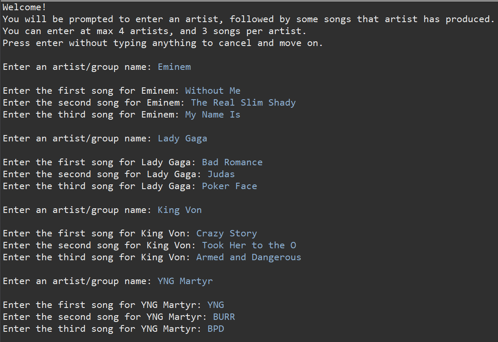
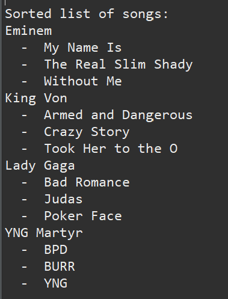

# Song Shuffler
A rudimentary shuffler written in C that takes in artist and song names from the user before sorting and shuffling them.

## User Input
The user can enter up to 4 artists at 3 songs each for a total of 12 songs. Users can enter fewer songs/artists by leaving the field blank. Reading string input is notoriously difficult in C, so I chose to tackle it with a `getchar()` loop being fed into a `char` array. It is automatically terminated at a provided character count to prevent buffer overflows. This approach works very well as it allows me to provide special behaviour to the enter key (in this case, being read as a null terminator or returning that the field was left empty).

## Sorting
The program uses Bubble Sort to sort songs. This algorithm was chosen for its implementation simplicity and the minimal performance implications for a maximum input size of n = 12. Songs are sorted first by their artist name, followed by the song name. These steps can both be performed in the same pass by first comparing the artist name, then comparing the song names if the artist is the same, and only marking it as sorted if both comparisons pass. 

## Shuffling
The program uses the Fisher-Yates algorithm to shuffle songs. This algorithm was chosen due to its unbiased permutations and O(n) time complexity. Each song is first duplicated so that it will feature on the playlist twice. Following this, a naive shuffle is performed. However, to improve listening experience, a minimum gap should occur between duplicate songs on the playlist. This minimum distance is set at half the number of unique songs, capped at distance = 5. To fulfil this condition I designed the following algorithm:
1. Calculate `gap_size` using the step above
2. Iterating through each song in the playlist, find the distance between it and its duplicate. This is denoted `distance`
3. If `distance <= gap_size` then we loop through the other songs in the list, starting from the first valid position 
4. For each position that the song can move to, we check whether the song currently in that position would fulfil the distance requirement if it was swapped with the current song
5. Once we have found a match, we swap the position of both songs

This sacrifices a small amount of randomness but ensures a more balanced listening experience.